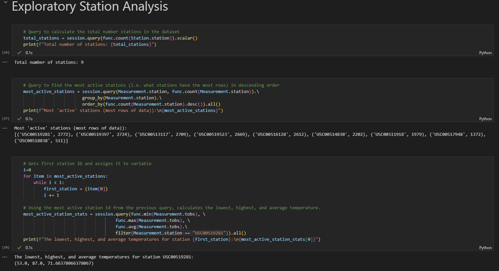

## A climate analysis to help with trip planning to Honolulu, Hawaii performed with SQLAlchemy and Flask API

#### *All project data (app.py Python script and climate.ipynb Jupyter Notebook) is in the SurfsUp directory, with datasets being in the Resources sub-directory*

